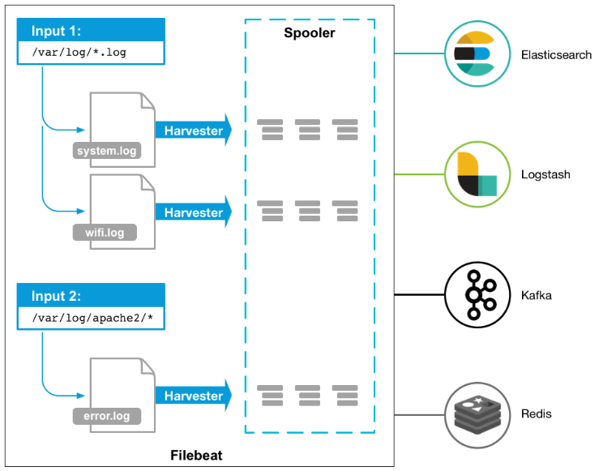
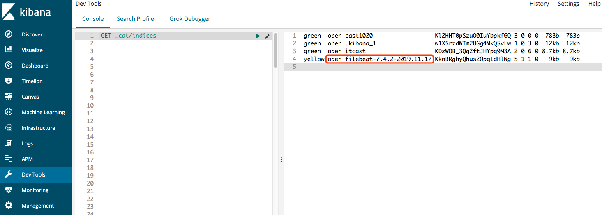
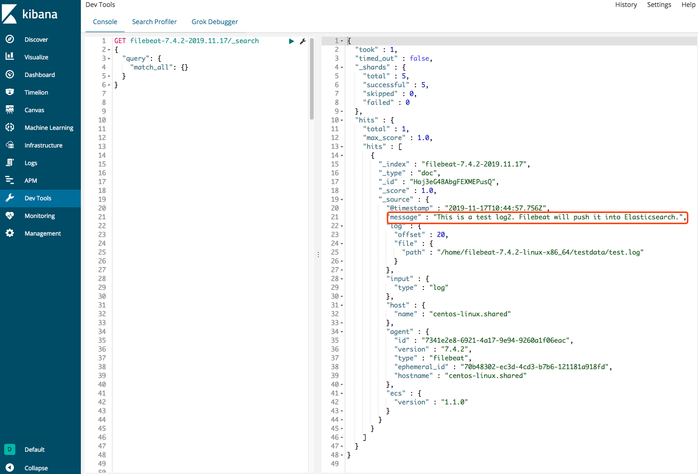

# Filebeat基础知识
* Filebeat简介
* Filebeat架构
* Filebeat安装
* Filebeat读取文件
* Filebeat输出到Elasticsearch
* Filebeat工作原理


## Filebeat简介
Filebeat是ELK Stack中收集数据的Beat中的一个分支，它专门用来收集原始日志文件数据，无缝传递给下游的数据过滤或者数据存储stack。
>###FILEBEAT
>
>###轻量型日志采集器
>
>当您要面对成败上千甚至上万的服务器、虚拟机和容器生成的日志时，请告别SSH吧，Filebeat将为您提供一种轻量型方法，拥有转发和汇总日志与文件，让简单的事情不在复杂。
>
>###Filebeat 让简单的事情简单化
>Filebeat 内置有多种模块（auditd、Apache、NGINX、System、MySQL 等等），可针对常见格式的日志大大简化收集、解析和可视化过程，只需一条命令即可。之所以能实现这一点，是因为它将自动默认路径（因操作系统而异）与 Elasticsearch 采集节点管道的定义和 Kibana 仪表板组合在一起。不仅如此，数个 Filebeat 模块还包括预配置的 Machine Learning 任务。

## Filebeat架构



Filebeat可以收集不同类型的日志文件，甚至是监听一个目录下的所有日志文件，通过Harvester不端的监听日志文件，然后将新增的日志数据通过Spooler传递到下游的Elasticsearch、Logstash、Kafka或者Redis中，

## Filebeat安装
1. 下载安装包
官网下载适配相应移动的安装包: [https://www.elastic.co/cn/downloads/beats/filebeat](https://www.elastic.co/cn/downloads/beats/filebeat)
2. 解压filebeat安装包`tar -zxvf filebeat-7.4.2-linux-x86_64.tar.gz`
3. 新建一个测试的filebeat的配置文件filebat_test.yml，这个配置文件的意思是：我们开启一个filebeat进程，然后filebeat抓取我们在控制台的输入，然后输出到控制台。

	```
filebeat.inputs:
- type: stdin
  enabled: true
output.console:
  pretty: true
  enable: true
```
4. 运行filebeat，加载测试的配置文件。

	```
[root@centos-linux filebeat-7.4.2-linux-x86_64]# ./filebeat -e -c filebeat_test.yml
2019-11-17T18:12:49.252+0800	INFO	instance/beat.go:607	Home path: [/home/filebeat-7.4.2-linux-x86_64] Config path: [/home/filebeat-7.4.2-linux-x86_64] Data path: [/home/filebeat-7.4.2-linux-x86_64/data] Logs path: [/home/filebeat-7.4.2-linux-x86_64/logs]
2019-11-17T18:12:49.266+0800	INFO	instance/beat.go:615	Beat ID: 7341e2e8-6921-4a17-9e94-9260a1f06eac
2019-11-17T18:12:49.267+0800	INFO	[seccomp]	seccomp/seccomp.go:124	Syscall filter successfully installed
...

	```
5. 在控制台输入测试数据：hello filebeat, 查看控制台输出。

	```
	hello filebeat
 {
  "@timestamp": "2019-11-17T10:15:56.705Z",
  "@metadata":  {
    "beat": "filebeat",
    "type": "_doc",
    "version": "7.4.2"
  },
  "message": "hello filebeat",
  "log": {
    "offset": 0,
    "file": {
      "path": ""
    }
  },
  "input": {
    "type": "stdin"
  },
  "ecs": {
    "version": "1.1.0"
  },
  "host": {
    "name": "centos-linux.shared"
  },
  "agent": {
    "version": "7.4.2",
    "type": "filebeat",
    "ephemeral_id": "a9eabbf9-0067-4609-b4c3-82be53a613c7",
    "hostname": "centos-linux.shared",
    "id": "7341e2e8-6921-4a17-9e94-9260a1f06eac"
  }
}
```
	filebeat在控制台的输出结果是一个json格式的信息。这个json包含:时间戳、filebeat的信息、filebeat抓取的message、log信息的地址和起始位置、filebeat接收输入的类型等等。当然最终要的我们输入的hello filebeat就是在message中。这个json也就是下游的logstash、es或者是kafka接收的输入。
	

## Filebeat读取文件
读取文件最直接的就是修改filebeat配置文件的input代码块。

```
# 配置读取文件 filebeat_testlog.yml，读取test.log，然后输出到控制台。
filebeat.inputs:
- type: log
  enabled: true
  paths:
    - /home/filebeat-7.4.2-linux-x86_64/testdata/test.log

output.console:
  pretty: true
  enable: true
```
建立上述配置文件`test.log`之后，我们启动该配置文件的filebeat进程，这个时候我们的`/home/filebeat-7.4.2-linux-x86_64/testdata/test.log`日志文件中还没有内容，所以控制台只有一些filebeat的信息。

```
[root@centos-linux filebeat-7.4.2-linux-x86_64]# ./filebeat -e -c filebeat_testlog.yml
2019-11-17T18:27:41.806+0800	INFO	instance/beat.go:607	Home path: [/home/filebeat-7.4.2-linux-x86_64] Config path: [/home/filebeat-7.4.2-linux-x86_64] Data path: [/home/filebeat-7.4.2-linux-x86_64/data] Logs path: [/home/filebeat-7.4.2-linux-x86_64/logs]
2019-11-17T18:27:41.806+0800	INFO	instance/beat.go:615	Beat ID: 7341e2e8-6921-4a17-9e94-9260a1f06eac
2019-11-17T18:27:41.806+0800	INFO	[seccomp]	seccomp/seccomp.go:124	Syscall filter successfully installed
2019-11-17T18:27:41.806+0800	INFO	[beat]	instance/beat.go:903	Beat info	{"system_info": {"beat": {"path": {"config": "/home/filebeat-7.4.2-linux-x86_64", "data": "/home/filebeat-7.4.2-linux-x86_64/data", "home": "/home/filebeat-7.4.2-linux-x86_64", "logs": "/home/filebeat-7.4.2-linux-x86_64/logs"}, "type": "filebeat", "uuid": "7341e2e8-6921-4a17-9e94-9260a1f06eac"}}}
2019-11-17T18:27:41.806+0800	INFO	[beat]	instance/beat.go:912	Build info	{"system_info": {"build": {"commit": "15075156388b44390301f070960fd8aeac1c9712", "libbeat": "7.4.2", "time": "2019-10-28T19:46:13.000Z", "version": "7.4.2"}}}
2019-11-17T18:27:41.806+0800	INFO	[beat]	instance/beat.go:915	Go runtime info	{"system_info": {"go": {"os":"linux","arch":"amd64","max_procs":2,"version":"go1.12.9"}}}
2019-11-17T18:27:41.808+0800	INFO	[beat]	instance/beat.go:919	Host info	{"system_info": {"host": {"architecture":"x86_64","boot_time":"2019-11-17T00:31:27+08:00","containerized":false,"name":"centos-linux.shared","ip":["127.0.0.1/8","::1/128","10.211.55.4/24","fdb2:2c26:f4e4:0:21c:42ff:fe0a:c867/64","fe80::21c:42ff:fe0a:c867/64","192.168.122.1/24"],"kernel_version":"3.10.0-1062.el7.x86_64","mac":["00:1c:42:0a:c8:67","52:54:00:b5:6d:71","52:54:00:b5:6d:71"],"os":{"family":"redhat","platform":"centos","name":"CentOS Linux","version":"7 (Core)","major":7,"minor":7,"patch":1908,"codename":"Core"},"timezone":"CST","timezone_offset_sec":28800,"id":"be71e9c28d054b4ba048153c351d0b80"}}}
2019-11-17T18:27:41.808+0800	INFO	[beat]	instance/beat.go:948	Process info	{"system_info": {"process": {"capabilities": {"inheritable":null,"permitted":["chown","dac_override","dac_read_search","fowner","fsetid","kill","setgid","setuid","setpcap","linux_immutable","net_bind_service","net_broadcast","net_admin","net_raw","ipc_lock","ipc_owner","sys_module","sys_rawio","sys_chroot","sys_ptrace","sys_pacct","sys_admin","sys_boot","sys_nice","sys_resource","sys_time","sys_tty_config","mknod","lease","audit_write","audit_control","setfcap","mac_override","mac_admin","syslog","wake_alarm","block_suspend"],"effective":["chown","dac_override","dac_read_search","fowner","fsetid","kill","setgid","setuid","setpcap","linux_immutable","net_bind_service","net_broadcast","net_admin","net_raw","ipc_lock","ipc_owner","sys_module","sys_rawio","sys_chroot","sys_ptrace","sys_pacct","sys_admin","sys_boot","sys_nice","sys_resource","sys_time","sys_tty_config","mknod","lease","audit_write","audit_control","setfcap","mac_override","mac_admin","syslog","wake_alarm","block_suspend"],"bounding":["chown","dac_override","dac_read_search","fowner","fsetid","kill","setgid","setuid","setpcap","linux_immutable","net_bind_service","net_broadcast","net_admin","net_raw","ipc_lock","ipc_owner","sys_module","sys_rawio","sys_chroot","sys_ptrace","sys_pacct","sys_admin","sys_boot","sys_nice","sys_resource","sys_time","sys_tty_config","mknod","lease","audit_write","audit_control","setfcap","mac_override","mac_admin","syslog","wake_alarm","block_suspend"],"ambient":null}, "cwd": "/home/filebeat-7.4.2-linux-x86_64", "exe": "/home/filebeat-7.4.2-linux-x86_64/filebeat", "name": "filebeat", "pid": 18697, "ppid": 13756, "seccomp": {"mode":"filter","no_new_privs":true}, "start_time": "2019-11-17T18:27:41.770+0800"}}}
2019-11-17T18:27:41.808+0800	INFO	instance/beat.go:292	Setup Beat: filebeat; Version: 7.4.2
2019-11-17T18:27:41.809+0800	INFO	[publisher]	pipeline/module.go:97	Beat name: centos-linux.shared
2019-11-17T18:27:41.809+0800	WARN	beater/filebeat.go:152	Filebeat is unable to load the Ingest Node pipelines for the configured modules because the Elasticsearch output is not configured/enabled. If you have already loaded the Ingest Node pipelines or are using Logstash pipelines, you can ignore this warning.
2019-11-17T18:27:41.809+0800	INFO	[monitoring]	log/log.go:118	Starting metrics logging every 30s
2019-11-17T18:27:41.809+0800	INFO	instance/beat.go:422	filebeat start running.
2019-11-17T18:27:41.809+0800	INFO	registrar/registrar.go:145	Loading registrar data from /home/filebeat-7.4.2-linux-x86_64/data/registry/filebeat/data.json
2019-11-17T18:27:41.810+0800	INFO	registrar/registrar.go:152	States Loaded from registrar: 1
2019-11-17T18:27:41.810+0800	WARN	beater/filebeat.go:368	Filebeat is unable to load the Ingest Node pipelines for the configured modules because the Elasticsearch output is not configured/enabled. If you have already loaded the Ingest Node pipelines or are using Logstash pipelines, you can ignore this warning.
2019-11-17T18:27:41.810+0800	INFO	crawler/crawler.go:72	Loading Inputs: 1
2019-11-17T18:27:41.810+0800	INFO	log/input.go:152	Configured paths: [/home/filebeat-7.4.2-linux-x86_64/testdata/test.log]
2019-11-17T18:27:41.810+0800	INFO	input/input.go:114	Starting input of type: log; ID: 15310153973465065004 
2019-11-17T18:27:41.810+0800	INFO	crawler/crawler.go:106	Loading and starting Inputs completed. Enabled inputs: 1
2019-11-17T18:27:41.810+0800	INFO	log/harvester.go:251	Harvester started for file: /home/filebeat-7.4.2-linux-x86_64/testdata/test.log
```

我们新开一个命令框向`test.log`中写入1条数据："This is a test log1"

```
[root@centos-linux testdata]echo "This is a test log1" >> test.log

```

看一下filebeat的控制台输出。

```
{
  "@timestamp": "2019-11-17T10:32:26.835Z",
  "@metadata": {
    "beat": "filebeat",
    "type": "_doc",
    "version": "7.4.2"
  },
  "host": {
    "name": "centos-linux.shared"
  },
  "agent": {
    "id": "7341e2e8-6921-4a17-9e94-9260a1f06eac",
    "version": "7.4.2",
    "type": "filebeat",
    "ephemeral_id": "1e2cdf9a-076e-4f66-9b73-9b390977685f",
    "hostname": "centos-linux.shared"
  },
  "log": {
    "offset": 0,
    "file": {
      "path": "/home/filebeat-7.4.2-linux-x86_64/testdata/test.log"
    }
  },
  "message": "This is a test log1",
  "input": {
    "type": "log"
  },
  "ecs": {
    "version": "1.1.0"
  }
}
```

可以看到输出的json字符串中，message中包含了我们输入的信息。

## Filebeat输出到Elasticsearch
输出到Elasticsearch也很简单，只需要修改filebeat配置文件中的output代码块。

```
# 配置读取文件 filebeat_testes.yml，读取test.log，然后输出到控制台。
filebeat.inputs:
- type: log
  enabled: true
  paths:
    - /home/filebeat-7.4.2-linux-x86_64/testdata/test.log

output.elasticsearch:
  hosts: ["10.211.55.4:9200"]
```

同样开启filebeat进程。
```
root@centos-linux filebeat-7.4.2-linux-x86_64]# ./filebeat -e -c filebeat_testlog.yml
```

然后向test.log中写入数据，就可以看到es中有数据了。此处我写入的是`echo "This is a test log2. Filebeat will push it into Elasticsearch." >> test.log`。

接下来就是去es中进行数据查看了，查看es数据有很多种方法，比如：通过es的网页插件ElasticSearch Head来查看，或者通过kibana来查看，或者直接通过request来查看。这里我通过kibana来查看。通过`GET _cat/indices`就看看到当前es中的所有索引数据，因为filebeat_testlog.yml配置文件中并未指定推送到es中数据的索引名称，所以filebeat开头中间带版本号和日期的索引就是我们刚刚开启的filebeat程序推送到es中的数据了：`filebeat-7.4.2-2019.11.17`。


我们在通过es查询语句查看，filebeat推送到es中的索引数据内容。其中message就储存了test.log中的新增日志信息。


## Filebeat工作原理
Filebeat主要由两个组件组成：prospector和harvester。

* harvester:
	* 负责读取单个文件的内容。
	* 如果文件在读取时被删除或者重命名，Filebeat将继续读取文件。
* prospector:
	* 负责管理harvester并找到所有要读取文件的来源。
	* 如果输入类型为日志，则prospector将查找路径匹配的所有文件，并为每一个文件启动给一个harvester。
	* Filebeat目前支持两种prospector类型;log和stdin。

####问题：Filebeat如何记录文件的状态？
* Filebeat通过将文件的状态刷新到磁盘上的注册文件中来保存每个文件的状态。这个文件位于filebeat目录下的`data/registry`中。该状态用于记住harvester正在读取的文件的最后偏移量offset，并确保发送所有文件的行内容。
* 如果filebeat的output无法访问(比如Elasticsearch宕机了)，Filebeat会追踪最后发送的行，并在output恢复时，继续读取文件。
* Filebeat运行时，每个prospector内存中也会保存文件的状态信息，当重启Filebeat时，将使用前面记录哎磁盘上的注册文件数据来重建之前读取的日志文件的状态，Filebeat让每个harvester从注册文件中保存的最后偏移量offset继续读取。

